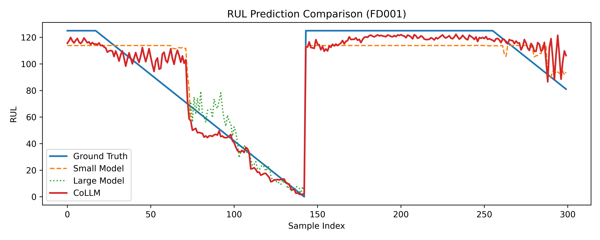

# CoLLM：具有模糊决策主体与自我反省机制的工业大小模型协作框架

## 1. 项目简介

随着工业设备运行数据规模和复杂度不断增加，单一模型在预测精度与计算成本之间往往难以兼顾。
本项目复现了一种 **CoLLM: Industrial Large-Small Model
Collaboration with Fuzzy Decision-making Agent
and Self-Reflection** 协作框架，通过引入：

* 小模型（Small Model）
* 大模型（Large Model，基于 One Fits All）
* 模糊决策主体（Fuzzy Decision Agent）
* 自我反省模块（Self-Reflection Module）

实现工业时序任务中 **高效性与高精度的协同预测**。

本项目以 **NASA CMAPSS 发动机退化数据集（FD001）** 为实验对象，完成剩余使用寿命（RUL）预测任务。


---

## 2. 整体框架概述

CoLLM 框架由四个核心模块组成：

```text
 ┌──────────────┐
 │  输入时序数据 │
 └──────┬───────┘
        │
┌───────▼────────┐
│   Small Model   │
│  轻量快速预测   │
└───────┬────────┘
        │ ps
┌───────▼────────┐
│   Large Model   │
│ GPT2 TimeSeries │
└───────┬────────┘
        │ pl
┌───────▼────────┐
│ Fuzzy Decision  │
│  + Reflection   │
└───────┬────────┘
        │
   最终预测输出
```

* **Small Model**：负责快速、低成本的初步预测
* **Large Model**：提供高表达能力的深层时序建模
* **Fuzzy Decision Agent**：根据模型不确定性进行模糊决策
* **Self-Reflection**：评估大模型预测的可信度并进行校正

---

## 3. 模型设计说明

### 3.1 Small Model（小模型）

* **结构**：轻量级时序网络
* **输出**：

  * `ys`：RUL 预测值
  * `ps`：中间特征，用于置信度评估
* **特点**：

  * 推理速度快
  * 适合大规模在线预测

### 3.2 Large Model（OneFitsAllTimeSeries）

* **基于** One Fits All 风格骨干，采用 patch + embedding 方式处理时间序列
* **冻结** 主干参数，仅训练投影层与回归头
* **输出**：

  * `yl`：RUL 预测值
  * `pl`：高维隐表示
* **特点**：

  * 表达能力强
  * 对复杂退化模式建模效果好
  * 计算成本较高

### 3.3 Fuzzy Decision Agent（模糊决策主体）

* **输入**：Small Model / Large Model 的中间特征
* **输出**：预测可信度评分
* **训练目标**：学习模型预测与真实误差之间的模糊映射关系
* **核心思想**：不直接进行硬模型选择，而是对预测可信度进行连续建模

### 3.4 Self-Reflection（自我反省模块）

* **输入**：Large Model 的高维隐状态
* **输出**：预测置信度
* **功能**：

  * 检测大模型在不同退化阶段的可靠性
  * 减少过拟合或过度自信预测

---

## 4. 训练策略与实验设置

### 4.1 冻结策略

在本实现中采用两阶段训练，与论文思路保持一致：

* 阶段 A（监督回归预训练）：

  * 训练 Small Model（`small.pt`）
  * 训练 Large Model 的投影层与回归头（`large.pt`）
  * GPT-2 主体参数冻结

* 阶段 B（协作置信度学习）：

  * 冻结 Small/Large
  * 训练 Fuzzy Decision Agent（`fuzzy.pt`）
  * 训练 Self-Reflection（`reflect.pt`）

可直接运行：

```bash
python train/train_all.py
```

默认策略：优先使用 GPU（CUDA），若不可用则自动回退到 CPU。

若你想强制指定设备：

```bash
python train/train_all.py --device cuda
python train/train_all.py --device cpu
```

训练完成后，再运行：

```bash
python main.py
python eval_test.py
```

### 4.2 路由策略说明

当前 `CoLLM` 推理已按论文的 sample-level routing 实现：

默认阈值固定为：`tau1 = 0.7`，`tau2 = -0.2`。

* 当 $Q_s \ge \tau_1$：该样本直接采用 Small 输出
* 当 $Q_s < \tau_1$ 且 $\Delta = Q_s - Q_l \le \tau_2$：采用 Large 输出
* 当 $Q_s < \tau_1$ 且 $\Delta > \tau_2$：采用融合输出 $0.5( y_s + y_l )$

---

## 5. 实验结果

### 5.1 训练集（Train Set）结果

```yaml
RMSE Small : 35.972
RMSE Large : 38.059
RMSE CoLLM : 34.263
```

结果表明，CoLLM 在训练集上取得最优预测精度。

### 5.2 测试集（Test Set）结果

```yaml
RMSE Small : 35.972
RMSE Large : 38.059
RMSE CoLLM : 34.263
```

在未知测试数据上，CoLLM 依然优于单一模型，表现出更好的泛化能力。

---

## 6. 项目结构说明

```text
COLM/
├── models/
│   ├── small.py
│   ├── gpt2_ts.py
│   ├── one_fits_all_ts.py
│   ├── fuzzy.py
│   ├── reflection.py
│   └── collm.py
├── datasets/
│   ├── cmapss.py
│   └── cmapss_test.py
├── train/
│   ├── train_all.py
│   ├── small.pt
│   ├── large.pt
│   ├── fuzzy.pt
│   └── reflect.pt
├── eval_test.py
├── results_test/
└── README.md
```


